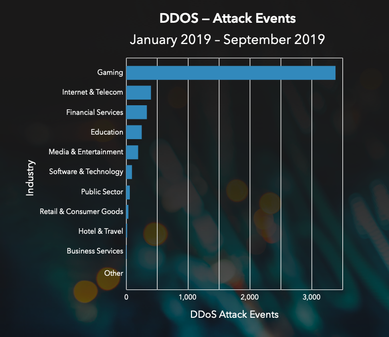
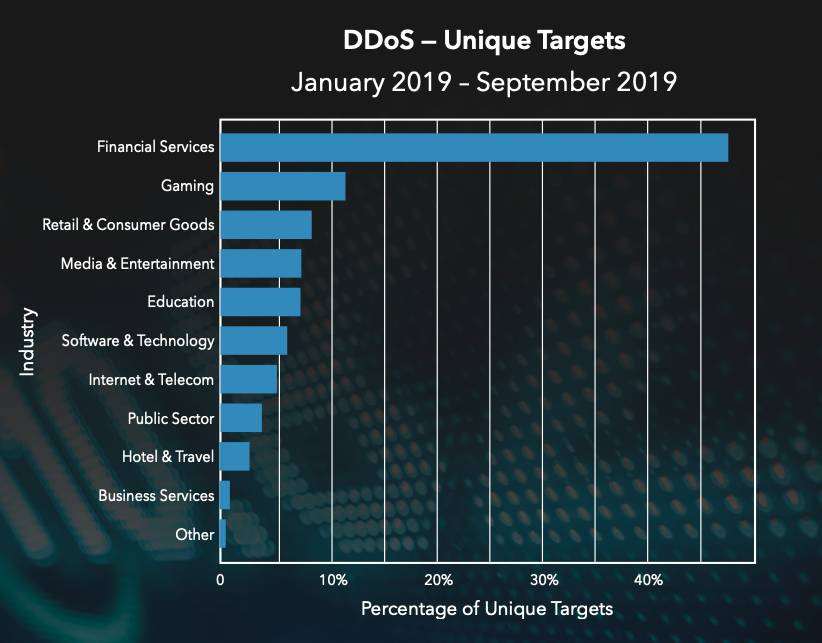

# Cybersecurity Threat Landscape (Part 2 - Akamai)

In this part, you should primarily use the _Akamai\_Security\_Year\_in\_Review\_2019_ and _Akamai State of the Internet/ Security_ plus independent research to answer the below questions. **SAM HASSOUN**

\_\_\_\_\_\_\_\_\_\_\_\_\_\_\_\_\_\_\_\_\_\_\_\_\_\_\_\_\_\_\_\_\_\_\_\_\_\_\_\_\_\_\_\_\_\_\_\_\_\_\_\_\_\_\_\_\_\_\_\_\_\_\_\_\_\_\_\_\_\_

1. DDOS attack events from January 2019 to September 2019 largely targeted which industry?

DDoS attack events from Jan 2019-Sept 2019 largely targeted the gaming industry according to the State of the Internet/Security Volume 5, Issue 4. As seen in this graph below

1. Almost 50% of unique targets for DDoS attacks from January 2019- September 2019 largely targeted which industry?

According to the State of the Internet/ Security : Year in Review, almost 50% of Unique targets for DDoS attacks from Jan 2019-Sept 2019 targeted the Financial Services Industry.

1. Which companies are the top phishing targets, according to Akamai?

According to Akamai, the companies that are the top phishing targets are High Tech companies like Microsoft, PayPal, DHL, Dropbox, DocuSign and LinkedIn.

1. What is credential stuffing?

Credential Stuffing is a type of attack where attackers use stolen usernames and passwords from one organisation they have breached to access user accounts at another organisation. The way it works is an attacker adds a list of stolen credentials (username and passwords) to a botnet that automates the process of trying those credentials on multiple sites at once.

1. Which country is the number one source of credential abuse attacks? Which country is number 2?

The USA is the number 1 source of credential abuse attacks in the world having 25,393,327,336 malicious logins between November 2017 and September 2019. Russia holds second place globally with 6,114,186,048 malicious logins for the same period..

1. Which country is the number one source of web application attacks? Which country is number 2?

The USA and Russia hold 1st and 2nd place in the global ranking for most web application attacks between November 2017 and September 2019. The USA had 1,434,231,212 total web application attacks and Russia had 1,093,219,355 web application attacks.

1. In Akamai&#39;s State of the Internet report, it refers to a possible DDoS team that the company thought was affecting a customer in Asia (starts on page 11).

- Describe what was happening.
- What did the team believe the source of the attack was?
- What did the team actually discover?

In 2018 Akamai noticed a customer in Asia was receiving abnormal amounts of web traffic on one of their URLS reaching 875,000 requests per second. Some of their logs registered 5.5Gbps of traffic. Initial analysis of the reports showed that there was a large amount of HTTP requests going to the customers URL. The SOCC (Special Operations Command Centre) made earlier determinations that there was a DDoS attack occurring. The SIRT (security Incident Response Team) worked on finding the cause while the SOCC focused on ensuring there was minimal disruption to customer operations. The SIRT noticed that there were 139 IP addresses approaching the customer&#39;s URL, which increased to 643 and peaked at well over 4 billion in less than a week.

After going through the logs and reports SIRT was confident that the Akamai platform mitigated 98% of the traffic which in essence protects their customers from DDoS attacks. In fact they were able to conclude that the high volume of traffic wasn&#39;t an attack at all. What they found was the traffic was the result of a warranty tool gone wrong. They discovered that a vendor tool was responsible for the tool and a fix was pushed within hours to fix the affected systems. Ultimately, what the team learned was that the extraordinary event they had encountered was with issues with the code and not a botnet problem which could have crashed the customers site. While not every incident that occurs is a malicious attack, what is significant is that the SOCC staff and SIRT researchers collaborated with each other to mitigate the issue in a timely manner. But just as significant is the need to develop a strong defensive posture to mitigate the risks of these events occurring. In this specific scenario, Akamai&#39;s client had configurations and finely tuned controls that were aligned to their needs which meant this issue could be resolved quickly.

1. What is an example of a performance issue with bot traffic?
Examples of performance issues with bot traffic are slowing down server response times which in turn increases customer dissatisfaction due to delays for end users accessing a site.

2. Known-good bots are bots that perform useful or helpful tasks, and not do anything malicious to sites or servers. What are the main categories of known-good bots?

The main categories of known good bots are

- Search Engine crawlers like Google or job search engines and the like
- Web archives that scan the web and record its contents to indexed databases
- Search engine optimization, audience analytics and marketing service. These bots are scraping websites and social media content that provide customers with market insights
- Site monitoring services are automated tools that monitor a sites health, its availability to visitors and performance under a load.
- Content aggregators are bots that scan multiple sources on the web like news, trends, product updates, price changes and stock quotes.

1. What are two evasion techniques that malicious bots use?
Malicious bots have multiple methods of evasion to avoid detection. One such method is altering the user agent or HTTP header values allowing bots to impersonate commonly used browsers, mobile applications or known good bots. Malicious bots can also change the IP addresses used in order to hide their origin or even use multiple IP addresses. Other methods of evasion are cookie tampering by harvesting good cookies and playing them back. Concerningly there are many more evasive methods malicious bots use