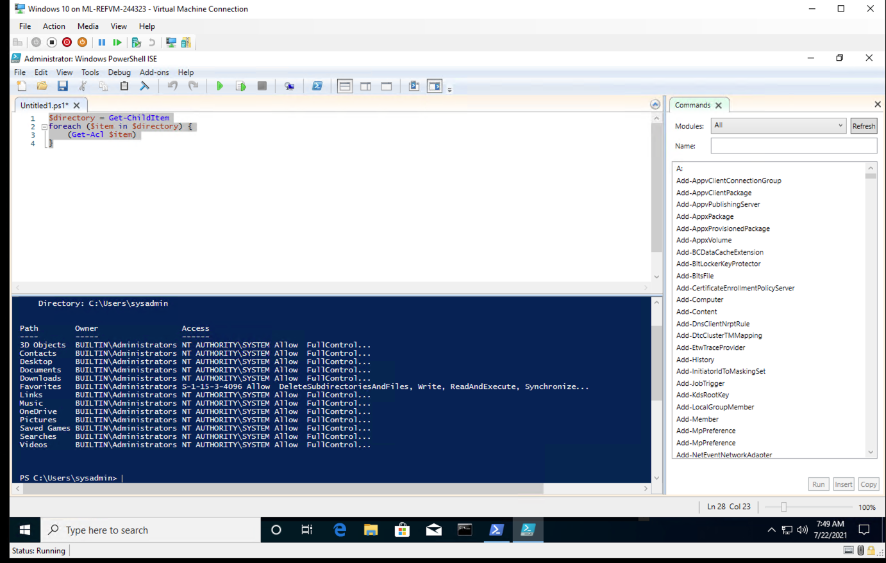

Week 7 Homework: A Day in the Life of a Windows Sysadmin : Sam Hassoun

**Task 1: Create a GPO: Disable Local Link Multicast Name Resolution (LLMNR)**

 

**Task 2: Create a GPO: Account Lockout**

**Task 3: Create a GPO: Enabling Verbose PowerShell Logging and Transcription**

### **Task 4: Create a Script: Enumerate Access Control Lists**

### **Bonus Task 5: Verify Your PowerShell Logging GPO**

