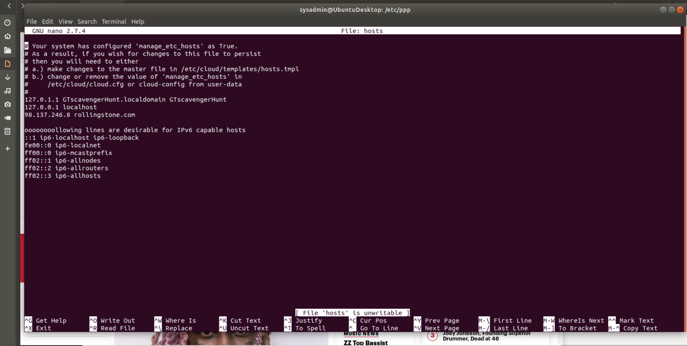
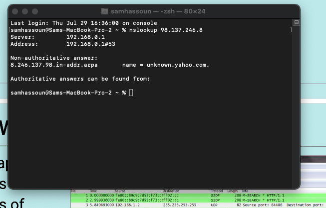
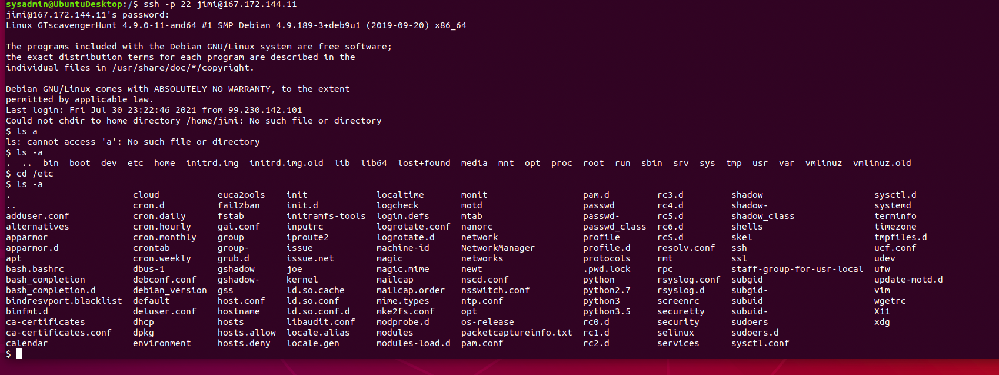
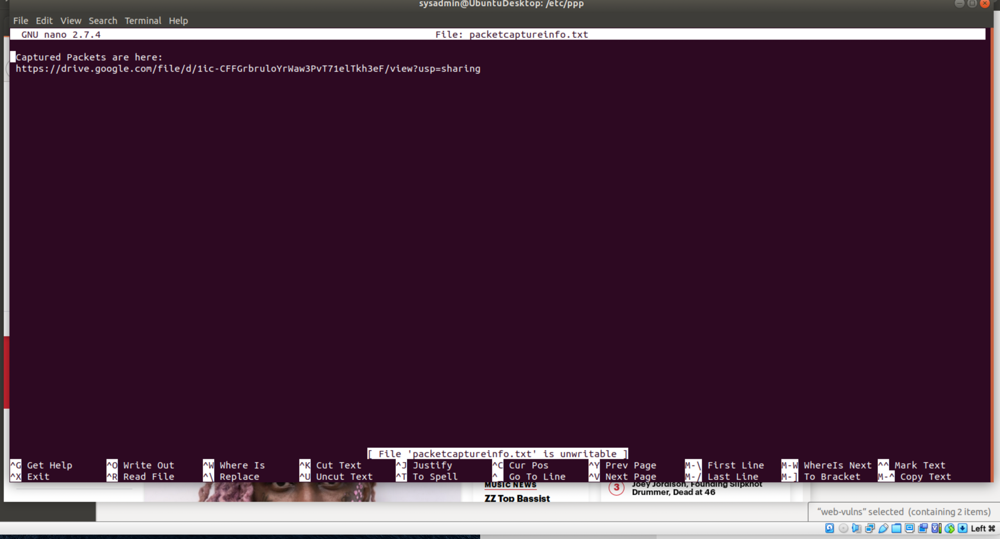
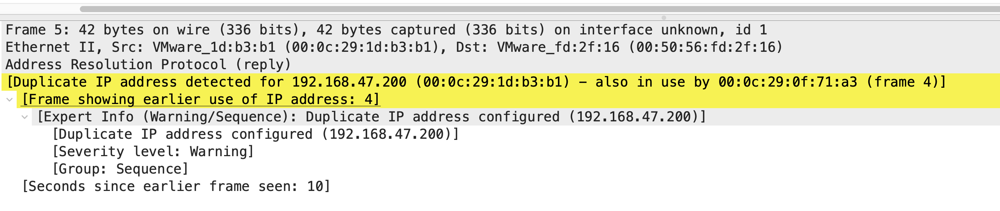
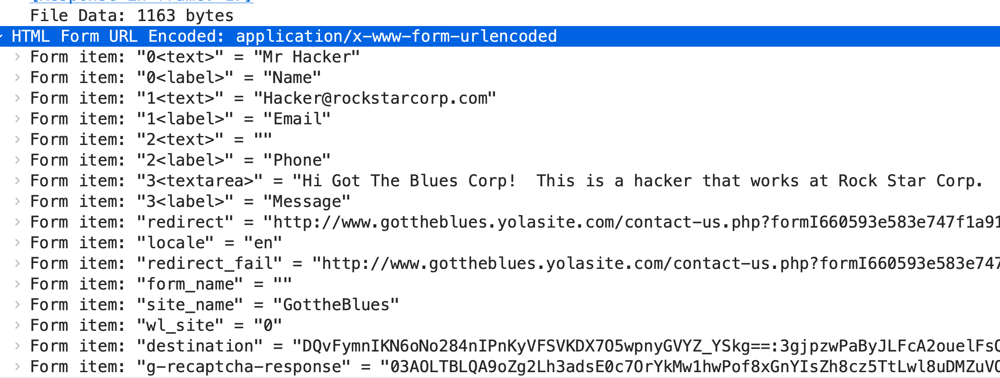

**Networking Fundamentals Homework:**

**Rocking your Network! Sam Hassoun**

### **Phase 1:** _ **&quot;I&#39;d like to Teach the World to Ping&quot;** _

The RockStar Corp servers in the Hollywood Office were identified as:

| 15.199.95.91/28 | | Hollywood Database Servers |
| --- | --- | --- |
| 15.199.94.91/28 | | Hollywood Web Servers |
| 11.199.158.91/28 | | Hollywood Web Servers |
| 167.172.144.11/32 | | Hollywood Application Servers |
| 11.199.141.91/28 | | Hollywood Application Servers |

**HOLLYWOOD DATABASE SERVERS 15.199.95.91/28**

The IP range for these database servers was determined to be

15.199.95.80 to 15.199.95.95 . I then proceeded to run the fping command using the options -s and -g. The -s option prints out cumulative statistics upon exit and the -g option allows us to generate a target list of IP addresses to inspect multiple IP&#39;s in one command.

This command generated the following results.

sysadmin@UbuntuDesktop:~$ fping -s -g 15.199.95.80 15.199.95.95

15.199.95.80 is unreachable

15.199.95.81 is unreachable

15.199.95.82 is unreachable

15.199.95.83 is unreachable

15.199.95.84 is unreachable

15.199.95.85 is unreachable

15.199.95.86 is unreachable

15.199.95.87 is unreachable

15.199.95.88 is unreachable

15.199.95.89 is unreachable

15.199.95.90 is unreachable

15.199.95.91 is unreachable

15.199.95.92 is unreachable

15.199.95.93 is unreachable

15.199.95.94 is unreachable

15.199.95.95 is unreachable

16 targets

0 alive

16 unreachable

0 unknown addresses

16 timeouts (waiting for response)

64 ICMP Echos sent

0 ICMP Echo Replies received

0 other ICMP received

0.00 ms (min round trip time)

0.00 ms (avg round trip time)

0.00 ms (max round trip time)

4.612 sec (elapsed real time)

- · We have established that the IP range for these Hollywood Database Servers are not currently accepting connections.

**HOLLYWOOD WEB SERVERS 15.199.94.91/28**

The IP range for these web servers was determined to be

15.199.94.80 to 15.199.94.95 . I then proceeded to run the fping command using the options -s and -g. The -s option prints out cumulative statistics upon exit and the -g option allows us to generate a target list of IP addresses to inspect multiple IP&#39;s in one command.

This command generated the following results.

sysadmin@UbuntuDesktop:~$fping -s -g 15.199.94.80 15.199.94.95

15.199.94.80 is unreachable

15.199.94.81 is unreachable

15.199.94.82 is unreachable

15.199.94.83 is unreachable

15.199.94.84 is unreachable

15.199.94.85 is unreachable

15.199.94.86 is unreachable

15.199.94.87 is unreachable

15.199.94.88 is unreachable

15.199.94.89 is unreachable

15.199.94.90 is unreachable

15.199.94.91 is unreachable

15.199.94.92 is unreachable

15.199.94.93 is unreachable

15.199.94.94 is unreachable

15.199.94.95 is unreachable

16 targets

0 alive

16 unreachable

0 unknown addresses

16 timeouts (waiting for response)

64 ICMP Echos sent

0 ICMP Echo Replies received

0 other ICMP received

0.00 ms (min round trip time)

0.00 ms (avg round trip time)

0.00 ms (max round trip time)

4.245 sec (elapsed real time)

- · We have established that the IP range for these Hollywood Web Servers are not currently accepting connections.

**HOLLYWOOD WEB SERVERS 11.199.158.91/28**

The IP range for these web servers was determined to be

11.199.158.80 to 11.199.158.95 . I then proceeded to run the fping command using the options -s and -g. The -s option prints out cumulative statistics upon exit and the -g option allows us to generate a target list of IP addresses to inspect multiple IP&#39;s in one command.

This command generated the following results.

sysadmin@UbuntuDesktop:~$fping -s -g 11.199.158.80 11.199.158.95

11.199.158.80 is unreachable

11.199.158.81 is unreachable

11.199.158.82 is unreachable

11.199.158.83 is unreachable

11.199.158.84 is unreachable

11.199.158.85 is unreachable

11.199.158.86 is unreachable

11.199.158.87 is unreachable

11.199.158.88 is unreachable

11.199.158.89 is unreachable

11.199.158.90 is unreachable

11.199.158.91 is unreachable

11.199.158.92 is unreachable

11.199.158.93 is unreachable

11.199.158.94 is unreachable

11.199.158.95 is unreachable

16 targets

0 alive

16 unreachable

0 unknown addresses

16 timeouts (waiting for response)

64 ICMP Echos sent

0 ICMP Echo Replies received

0 other ICMP received

0.00 ms (min round trip time)

0.00 ms (avg round trip time)

0.00 ms (max round trip time)

5.335 sec (elapsed real time)

- We have established that the IP range for these Hollywood Web Servers are not currently accepting connections.

**HOLLYWOOD APPLICATION SERVER 167.172.144.11/32**

This Hollywood Application Server was determined to be a single IP and when compared to the other servers RockStar Corp have on their network was deemed suspicious. The ping command was used with a -c option to give line by line statistics of packet request/response.

sysadmin@UbuntuDesktop:~$ping -c 4 167.172.144.11

PING 167.172.144.11 (167.172.144.11) 56(84) bytes of data.

64 bytes from 167.172.144.11: icmp\_seq=1 ttl=63 time=327 ms

64 bytes from 167.172.144.11: icmp\_seq=2 ttl=63 time=290 ms

64 bytes from 167.172.144.11: icmp\_seq=3 ttl=63 time=256 ms

64 bytes from 167.172.144.11: icmp\_seq=4 ttl=63 time=255 ms

--- 167.172.144.11 ping statistics ---

4 packets transmitted, 4 received, 0% packet loss, time 3003ms

rtt min/avg/max/mdev = 255.961/282.578/327.482/29.466 ms

- We have established that this Application Server is active and accepting connections.
- As an Application server that is supposed to not be accepting connections, this was established to be a vulnerability and with RockStar Corps concern of a hacker infiltrating the system, this was the 1st bit of evidence that their suspicions may be fact.

**HOLLYWOOD APPLICATION SERVERS 11.199.141.91/28**

The IP range for these web servers was determined to be

11.199.141.80 to 11.199.141.95 . I then proceeded to run the fping command using the options -s and -g. The -s option prints out cumulative statistics upon exit and the -g option allows us to generate a target list of IP addresses to inspect multiple IP&#39;s in one command.

sysadmin@UbuntuDesktop:~$fping -s -g 11.199.141.80 11.199.141.95

11.199.141.80 is unreachable

11.199.141.81 is unreachable

11.199.141.82 is unreachable

11.199.141.83 is unreachable

11.199.141.84 is unreachable

11.199.141.85 is unreachable

11.199.141.86 is unreachable

11.199.141.87 is unreachable

11.199.141.88 is unreachable

11.199.141.89 is unreachable

11.199.141.90 is unreachable

11.199.141.91 is unreachable

11.199.141.92 is unreachable

11.199.141.93 is unreachable

11.199.141.94 is unreachable

11.199.141.95 is unreachable

16 targets

0 alive

16 unreachable

0 unknown addresses

16 timeouts (waiting for response)

64 ICMP Echos sent

0 ICMP Echo Replies received

0 other ICMP received

0.00 ms (min round trip time)

0.00 ms (avg round trip time)

0.00 ms (max round trip time)

4.491 sec (elapsed real time)

- This Hollywood Application Server is not currently accepting connections.

In summary, we have been able to determine that of the 5 IP ranges representing servers at the Hollywood Offices, there is only one that is accepting connections. The Hollywood Application Server located at IP address (167.172.144.11). The OSI layer this server found is Layer 7: Application. As there have been concerns of possible infiltration, this is a vulnerability that represents serious risk. These threats include DDoS attacks, HTTP floods and SQL injections to name a few. To mitigate these threats, the use of web application firewalls, secure web gateways would be beneficial. This would limit risk and work as a front line defence to other exploits like worms, phishing, keyloggers and trojans.

**Phase 2:** _ **&quot;Some Syn for Nothin`&quot;** _

For this phase of our assessment we utilised nmap as a scanning tool to determine the status of ports on the RockStar Corps Hollywood network. The following command used was able to scan the 1000 most common ports.

sysadmin@UbuntuDesktop:~$sudo nmap -sS 167.172.144.11

[sudo] password for sysadmin:

Starting Nmap 7.60 ( https://nmap.org ) at 2021-07-29 05:02 EDT

RTTVAR has grown to over 2.3 seconds, decreasing to 2.0

RTTVAR has grown to over 2.3 seconds, decreasing to 2.0

RTTVAR has grown to over 2.3 seconds, decreasing to 2.0

RTTVAR has grown to over 2.3 seconds, decreasing to 2.0

RTTVAR has grown to over 2.3 seconds, decreasing to 2.0

RTTVAR has grown to over 2.3 seconds, decreasing to 2.0

Stats: 0:19:03 elapsed; 0 hosts completed (1 up), 1 undergoing SYN Stealth Scan

SYN Stealth Scan Timing: About 43.15% done; ETC: 05:46 (0:25:06 remaining)

Stats: 0:23:18 elapsed; 0 hosts completed (1 up), 1 undergoing SYN Stealth Scan

SYN Stealth Scan Timing: About 67.87% done; ETC: 05:37 (0:11:02 remaining)

Stats: 0:26:07 elapsed; 0 hosts completed (1 up), 1 undergoing SYN Stealth Scan

SYN Stealth Scan Timing: About 84.57% done; ETC: 05:33 (0:04:46 remaining)

Stats: 0:29:53 elapsed; 0 hosts completed (1 up), 1 undergoing SYN Stealth Scan

SYN Stealth Scan Timing: About 99.99% done; ETC: 05:32 (0:00:00 remaining)

Nmap scan report for 167.172.144.11

Host is up (2.4s latency).

Not shown: 999 closed ports

PORT STATE SERVICE

22/tcp open ssh

Nmap done: 1 IP address (1 host up) scanned in 1829.20 seconds

The result of the SYN SCAN performed using nmap found that port 22/tcp was open and all other ports were closed. The concern here is that port 22 is used for secure shell communication (SSH) which allows remote admin access. The concern here is if an attacker was able to obtain a username and password they would be able to SSH into the network and be able to perform malicious actions against RockStar Corp.

According to csoonline.com, weak passwords can make SSH and port 22 easy targets for attackers. As the dedicated Secure Shell port enables access to remote shells on servers. So if the credentials include default or weak username/password combinations this will lead to increased attacks. As SSH supports Tunnels/Port Forwarding, if an attacker is able to gain access to an SSH server they can then direct traffic to a destination of their choice which would have serious ramifications for an organisation like RockStar Corp.

The way to mitigate this is by ensuring all credentials are strong and not easily exposed. Disable empty passwords, as well as limiting the access to SSH logins to specific users who require remote access. Disabling Root logins is another way to avoid serious risks of port 22 being attacked. In summary, proper configuration and strong authentication credentials are vital to protecting an open port 22 from attacks like brute force authentication attacks. It is highly recommended that there are protections in place like a firewall to secure SSH services and other servers from malicious actors. In conclusion, the SSH operates on the Layer 7 of the OSI table; Application Layer.

_ **Phase 3: &quot;I Feel a DNS Change Comin&#39; On&quot;** _

Based on the information we have gathered during the previous 2 phases, we have established that there is 1 server with ip address 167.172.144.11 receiving connecting and our SYN SCAN using nmap showed us that Port 22/TCP was open. Since RockStar typically uses the same default username of jimi and password hendrix, we will attempt an SSH login into this server to gather more information.

Using the following command: ssh -p 22 jimi@167.172.144.11

And using the password : hendrix , I was able to successfully login to the server ip that was accepting connections in phase 1.

I proceeded to /etc/hosts file and found the following:

I discovered that the hosts file had in fact been altered. This would account for limited access to the website and why a different website would open.

The entry discovered is : 98.137.246.8 rollingstone.com

I then typed exit to close the SSH connection to the server and used nslookup to discover what the domain of this IP was. The command used was:

nslookup 98.137.246.8

The result of this search can be seen in the screenshot below.

As we can see from the image above, this is not the site for Rockstar Corp, and this action was undertaken by a hacker at the application level 7.

### **Phase 4:** _ **&quot;ShARP Dressed Man&quot;** _

During the SSH session, there was an interesting file in the /etc folder. It was called packetcaptureinfo.txt .

Upon closer inspection of the txt file, I found the following information written to the file.

This link led us to a google doc download page for a file called secretlogs.pcapng.

Using Wireshark, we open this packet capture to further analyse the contents of the capture.

Based on the analysis of the packet capture and having a detailed look at the ARP packets, what is evident is that there was in fact a hacker who accessed the network. They were able to send a spoof ARP message to redirect all traffic to go to their mac address.

The ramifications of these actions are that the hacker can intercept sensitive information about Rockstar Corp and cause further damage to the organisation.

The HTTP packets also gave us a deeper look at what the hackers identity and intentions were. We were able to intercept the website the hacker was accessing.

[referer:](about:blank)[http://www.gottheblues.yolasite.com/\r\n](http://www.gottheblues.yolasite.com/%5Cr%5Cn)

[referer: http://www.gottheblues.yolasite.com/contact-us.php\r\n](about:blank)

[host:](about:blank)[www.gottheblues.yolasite.com\r\n](about:blank)

[Full request URI: http://www.gottheblues.yolasite.com/.well-known/http-opportunistic]

[Full request URI: http://forms.yola.com/formservice/en/3f64542cb2e3439c9bd01649ce5595ad/6150f4b54616438dbb01eb877296d534/c3a179f3630a440a96196bead53b76fa/I660593e583e747f1a91a77ad0d3195e3/]

Further investigation uncovered a message sent from within RockStar Corp to GottheBlues:

_Form item: &quot;3\&lt;textarea\&gt;&quot; = &quot;Hi Got The Blues Corp! This is a hacker that works at Rock Star Corp. Rock Star has left port 22, SSH open if you want to hack in. For 1 Milliion Dollars I will provide you the user and password!&quot;_

_As a result of the communication we have intercepted, we can confirm that we have an insider attack at RockStar Corp. Their details are in the next image below._

_In conclusion, the RockStar Corp was subject to an insider hacker who was planning to make money by sharing sensitive information with a competitor. Our assessment is that all 4 phases occurred at the application layer 7 of the OSI model. Lack of added security measures also contributed to this attack as weak usernames and passwords that in many cases were default credentials are not acceptable to protect an organisation&#39;s sensitive information. Added firewall protection and stronger SSH configurations for selected users who require remote server access is also recommended._