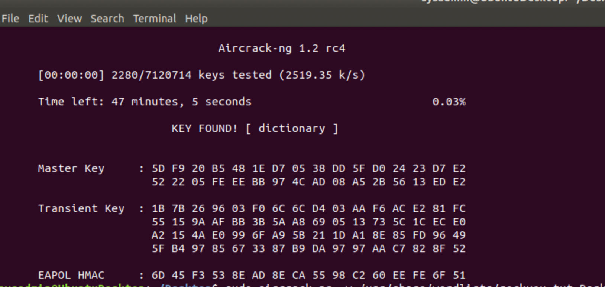
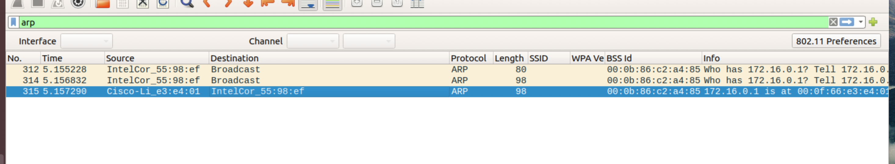

## **Networks Fundamentals II Homework:** _ **In a Network Far, Far Away!** _

### **Mission 1**

The issue of being able to send emails but not be able to receive emails sounds like there has been a disturbance in the force that can be explained by further investigating the MX records of the resistance.

nslookup -type=MX starwars.com

Server: 192.168.105.101

Address: 192.168.105.101#53

Non-authoritative answer:

starwars.com mail exchanger = 10 aspmx3.googlemail.com.

starwars.com mail exchanger = 5 alt2.aspmx.l.google.com.

starwars.com mail exchanger = 5 alt1.aspx.l.google.com.

starwars.com mail exchanger = 1 aspmx.l.google.com.

starwars.com mail exchanger = 10 aspmx2.googlemail.com.

As these results suggest, if the Resistance&#39;s Network Team built and deployed new primary and secondary mail servers, then the MX record of starwars.com would reflect these changes. Since no emails are able to be received, then the primary and secondary servers in the list above have been taken down by the empire. If one of these servers was still operational, then the emails would still come through filtering through the 4 faulty servers (by priority) till the 1 operational server was reached. As such, the new servers were not deployed correctly, so the issue we are seeing here is a misconfiguration of the MX records.

To rectify this issue, mail exchanger = 1 aspmx.l.google.com. Would be replaced with mail exchanger = 1 asltx.l.google.com as the primary mail server and mail exchanger = 5 asltx.2.google.com. For the secondary mail server.

### **Mission 2**

nslookup -type=txt theforce.net

Server: 192.168.0.1

Address: 192.168.0.1#53

Non-authoritative answer:

theforce.net text =&quot;google-site-verification=ycgY7mtk2oUZMagcffhFL\_Qaf8Lc9tMRkZZSuig0d6w&quot;

theforce.net text = &quot;v=spf1 a mx mx:smtp.secureserver.net include:aspmx.googlemail.com ip4:104.156.250.80 ip4:45.63.15.159 ip4:45.63.4.215&quot;

theforce.net text = &quot;google-site-verification=XTU\_We07Cux-6WCSOItl0c\_WS29hzo92jPE341ckbOQ&quot;

Addressing the DNS issue in mission 1 we have re-established communication with the mail servers as a result of the attack. When we determined the SPF record for theforce.net, we uncovered the explanation as to why many of the alert bulletins were being blocked or going to spam. The ip4 addresses in the SPF result we got do not match up with the ip address of the mail server that was changed as a result of the outage.

When receiving emails, Received-SPF looks at the ip address in the received field to determine if the incoming email is from an authorised sender. If the ip address differs to what is classified as authorised, the email will either get blocked or will go straight to the spam folder where unsolicited emails go.

A corrected SPF record would include the ip address 45.23.176.21:

theforce.net text = &quot;v=spf1 a mx mx:smtp.secureserver.net include:aspmx.googlemail.com ip4:104.156.250.80 ip4:45.63.15.159 ip4:45.63.4.215 ip4:45.23.176.21&quot;

By adding the IP address, this will ensure all emails are received, especially the alert bulletins that are critical to identify pending attacks from the Empire.

### **Mission 3**

The CNAME of [www.theforce.net](http://www.theforce.net/) is:

nslookup -q=cname www.theforce.net

Server: 192.168.0.1

Address: 192.168.0.1#53

Non-authoritative answer:

www.theforce.net canonical name = theforce.net.

Authoritative answers can be found from:

As we can see from the results above, resistance.force.net is not configured as a canonical/alias name of [www.theforce.net](http://www.theforce.net/) . It is for this reason, when accessing resistance.theforce.net via nslookup the response is \*\* server can&#39;t find www.resistance.theforce.net: NXDOMAIN .

A corrected DNS record including resistance.theforce.net would look like this:

resistance.theforce.net canonical name = theforce.net

### **Mission 4**

The DNS records for princessleia.site are:

nslookup -type=A princessleia.site

Server: 192.168.0.1

Address: 192.168.0.1#53

Non-authoritative answer:

Name: princessleia.site

Address: 34.102.136.180

nslookup -type=NS princessleia.site

Server: 192.168.0.1

Address: 192.168.0.1#53

Non-authoritative answer:

princessleia.site nameserver = ns25.domaincontrol.com.

princessleia.site nameserver = ns26.domaincontrol.com.

nslookup -type=SOA princessleia.site

Server: 192.168.0.1

Address: 192.168.0.1#53

Non-authoritative answer:

princessleia.site

origin = ns25.domaincontrol.com

mail addr = dns.jomax.net

serial = 2020062300

refresh = 28800

retry = 7200

expire = 604800

minimum = 600

The attack that took place on the princessleia.site in Alderaan was terrible and the loss of the primary DNS server could have been catastrophic if the Resistance didn&#39;t have a backup DNS that escaped the attack on an earlier transport ship. What this teaches us is the need to handle the overall security of our servers differently to ensure that any future attacks by the Empire do not have the same result.

What is proposed is for there to be multiple DNS servers at different geographic locations. For example Tatooine and Endor. If the primary server is destroyed in an attack on Tatooine, then the secondary backup server in Endor (ns2.galaxybackup.com) can maintain processing requests to princessleia.site . Other important measures to avoid future Empire DDos attacks would be to configure the network in a manner where all packet requests coming into the primary DNS server in Tatooine are controlled by a planetary deflector shield (Load Balancers) to stem the flow of malicious empire packet attacks.

The DNS record would look as follows:

princessleia.site nameserver = ns25.domaincontrol.com.

princessleia.site nameserver = ns26.domaincontrol.com.

princessleia.site nameserver = ns2.galaxybackup.com

### **Mission 5**

The shortest path the Resistance can use to improve traffic whilst avoiding Planet N is;

| # OF HOPS | FROM | COUNT | TO | TOTAL |
| --- | --- | --- | --- | --- |
| 1 | BATUU | 1 | D | 1 |
| 2 | D | 2 | C | 3 |
| 3 | C | 1 | E | 4 |
| 4 | E | 1 | F | 5 |
| 5 | F | 1 | J | 6 |
| 6 | J | 1 | I | 7 |
| 7 | I | 6 | L | 13 |
| 8 | L | 4 | Q | 17 |
| 9 | Q | 2 | T | 19 |
| 10 | T | 2 | V | 21 |
| 11 | V | 2 | JEDHA | 23 |

### **Mission 6**

Thanks to great sacrifices of our brave resistance members we were able to decipher vital information from the Darkside package that will give the Resistance an advantage to launch attacks against the empire.

Our goal is to decrypt the secret wireless key embedded deep in the Darkside.pcap capture. To do this we will utilise a new weapon in the Resistance arsenal call aircrack-ng.

sudo aircrack-ng -w /usr/share/wordlists/rockyou.txt Darkside.pcap

We are able to crack the secret key to provide further analysis of the capture file.

As we can see from the screenshots above, the Host IP addresses and MAC addresses found were:

- IP 172.16.0.1 Cisco-Li\_e3:e4:01 MAC 00:0f:66:e3:e4:01
- IP 172.16.0.101 IntelCor\_55:98:ef MAC 00:13:ce:55:98:ef

### **Mission 7**

 

As the command did not work, I used the backup link in the browser.

THE END