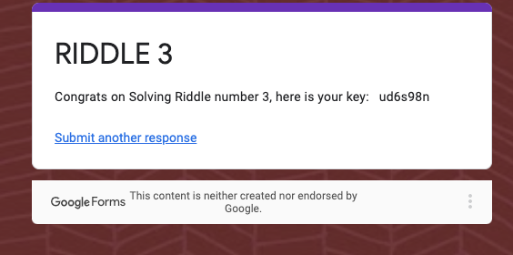
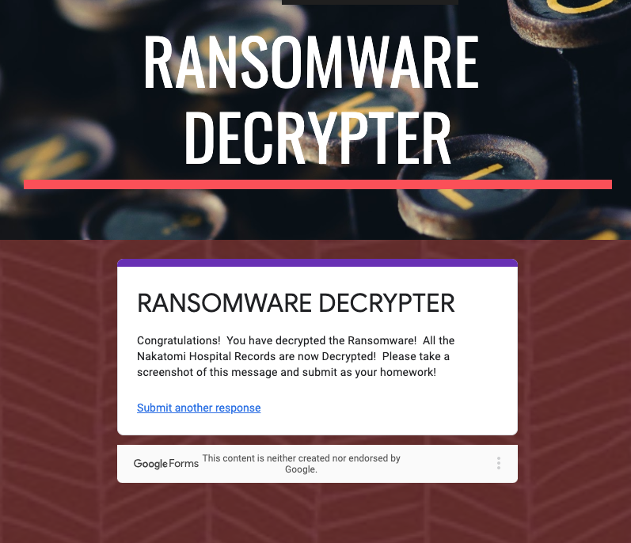

## **Cryptography Homework: Ransomware Riddles**

sysadmin@UbuntuDesktop:~/riddle\_3$ openssl enc -pbkdf2 -nosalt -aes-256-cbc -in cipher.txt.enc -d -base64 -K 5284A3B154D99487D9D8D8508461A478C7BEB67081A64AD9A15147906E8E8564 -iv 1907C5E255F7FC9A6B47B0E789847AED

takagi

