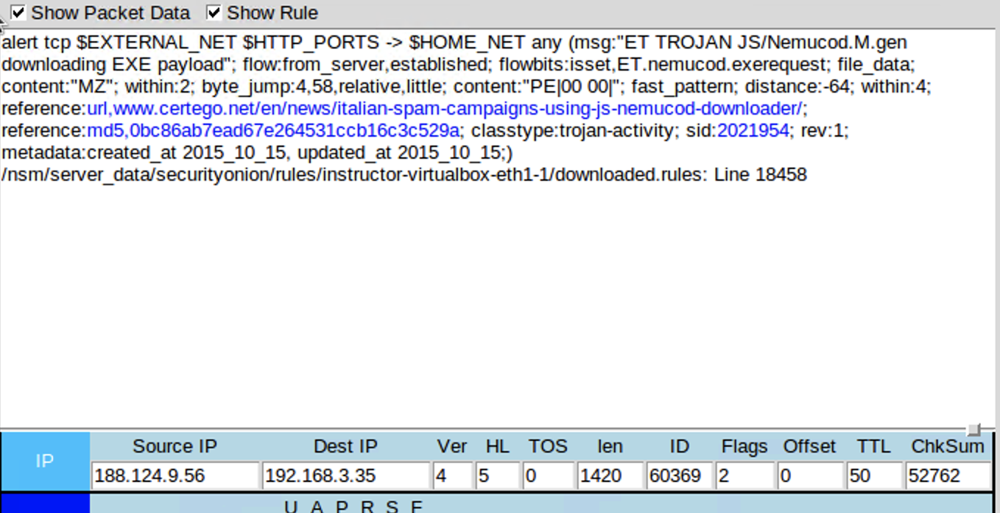
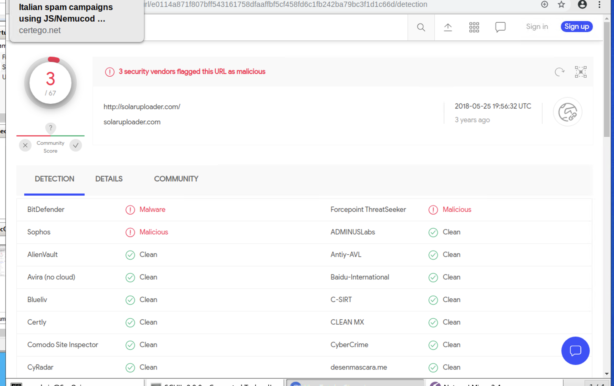

# **Cyber Threat Intelligence and Incident Response Report**

Cyber threat intelligence is information that is collected and evaluated by an organization to better understand the intents, capabilities, and TTPs of the malicious actors that pose threats.

Cyber threat intelligence helps reduce the risk of repeated breaches by allowing for risk mitigation strategies.

| Incident Name | TROJAN JS/Nemucod downloader |
| --- | --- |
| Report Author | Sam Hassoun |
| Report Date | 21/08/2021 |
|
 |
 |

## 1. What was the indicator of attack?

|
 | 
As per the above alert, a TROJAN JS/Nemucod.M downloader was reported which led to the discovery of a &#39;GET /40.exe HTTP/1.1&#39; message from a known malicious website. |
| --- | --- |

##

## 2. What was the adversarial motivation (purpose of attack)?

|
 | To gain unauthorized access to sensitive information and to gain control of assets with the intent of financial gain. As per the Certego article, this type of attack occurs in 2-3 stages with the ultimate goal of Command and Control. |
| --- | --- |

##

##

## 3. What were the adversary&#39;s actions and tactics?

Describe observations and indicators that may be related to the perpetrators of the intrusion. Categorize your insights according to the appropriate stage of the cyber kill chain, as structured in the following table.

| Reconnaissance | These attacks are coming via email attachments disguised as documents. This could be because of a possible breach of individuals or companies who are associated with the organization. |
| --- | --- |
| Weaponization | Via JavaScript downloader called JS/Nemucod which is attached to the emails inside a ZIP file. Once the document is opened the JavaScript executes via Internet Explorer. |
| Delivery | Through emails which may appear legitimate but are in fact spam. |
| Exploitation | Once executed, Nemucod will utilize 3 different Active X. controls: These include WScript.Shell, MSXML2.XMLHTTP and ADODB.Stream. Nemucod uses them to save and exe file to the temporary folder and to run it. Nemucod then opens a PDF file in the browser as a decoy whilst in the background malware is embedding itself onto the system to be executed. |
| Installation | A DLL library is downloaded through rundll32.exe in preparation for the payload to be executed |
| Command and Control | The computer begins to be rebooted and after a few instans Gozi starts phoning home after the reboot. This is a method that may be used to avoid detection. |
| Actions on Objectives | The files downloaded by Nemucod are used to retrieve a Trojan Downloader called Fareit or Pony downloader, which then downloads more executable files containing the Gozi infostealer. |

## 4. What are your recommended mitigation strategies?

|
 | As this was embedded in an email, more education should be provided to ensure all users are aware of the risks and able to identify legitimate email from suspicious unsolicited spam. Proper configuration of anti-spam software.Use anti-phishing services to counter these attacks. |
| --- | --- |

##

## 5. List your third-party references.

|
 | [https://www.certego.net/en/news/italian-spam-campaign-using-js-nemucod-downloader/](https://www.certego.net/en/news/italian-spam-campaign-using-js-nemucod-downloader/)[https://www.kaspersky.com.au/resource-center/preemptive-safety/simple-tips-spam-mail-protection](https://www.kaspersky.com.au/resource-center/preemptive-safety/simple-tips-spam-mail-protection)[https://www.virustotal.com](https://www.virustotal.com/)
 |
| --- | --- |

## \*\* THE ORIGIN OF THE SOURCE IP IS IN TURKEY\*\*

 

 

1| Page