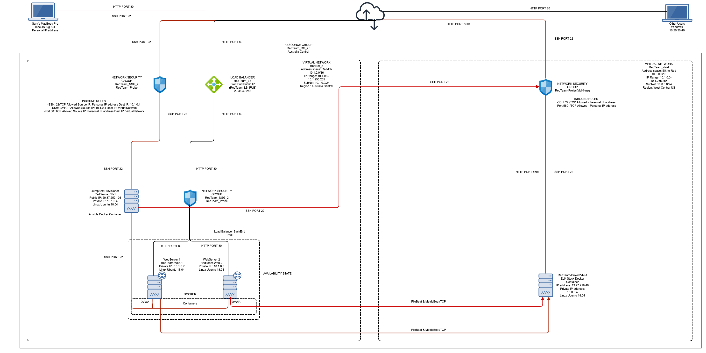

## Automated ELK Stack Deployment

The files in this repository were used to configure the network depicted below.

These files have been tested and used to generate a live ELK deployment on Azure. They can be used to either recreate the entire deployment pictured above. Alternatively, select portions of the playbook file may be used to install only certain pieces of it, such as Filebeat.

  - [How to Install and Launch filebeat](Playbooks/filebeat-playbook.yml)

This document contains the following details:
- Description of the Topology
- Access Policies
- ELK Configuration
  - Beats in Use
  - Machines Being Monitored
- How to Use the Ansible Build

### Description of the Topology

The main purpose of this network is to expose a load-balanced and monitored instance of DVWA, the D*mn Vulnerable Web Application.

Load balancing ensures that the application will be highly available, in addition to restricting traffic to the network.
 
Load Balancers are designed to protect the network from DDoS attacks by shifitng attack traffic from 1 server to others on the network to ensure a single server does not get overwhelmed to the point of becoming unavailable to authorised users/ legitimate traffic.

The advantage of a jump box is it provides a secure method for admins to connect to servers in order to launch administrative tasks in a secure and monitored environment. 

Integrating an ELK server allows users to easily monitor the vulnerable VMs for changes to the data and system logs.

Filebeat monitors the log files or locations that you specify, collects log events, and forwards them either to Elasticsearch or Logstash for indexing.

Metricbeat focuses more on the statistics and metrics of the data monitored.
 
The configuration details of each machine may be found below.

| Name                | Function        | Public IP Address | Private IP Address | Operating System   |
|---------------------|-----------------|-------------------|--------------------|--------------------|
| RedTeam-JBP-1       | JumpBox/GateWay | 20.37.252.126     |     10.1.0.4       | Linux Ubuntu 18.04 |
| RedTeam-ProjectVM-1 | ELK Server      | 13.77.218.49      |     10.0.0.4       | Linux Ubuntu 18.04 |
| RedTeam_LB          | Load Balancer   | 20.36.40.252      |         -          |          -         |
| RedTeam-Web-1       | WebServer       |        -          |     10.1.0.7       | Linux Ubuntu 18.04 |
| RedTeam-Web-2       | WebServer       |        -          |     10.1.0.8       | Linux Ubuntu 18.04 |

### Access Policies

The machines on the internal network are not exposed to the public Internet. 

Only the JumpBox Provisioner machine can accept connections from the Internet. Access to this machine is only allowed from the following IP addresses:

Machines within the network can only be accessed by SSH.

The only machines that I allowed SSH access to the ELK VM is the JumpBox Provisioner with IP address 10.1.0.4 and my Personal WorkStation.

A summary of the access policies in place can be found in the table below.

|         Nme         | Publicly Accessible |      Allowed IP Addresses      | Protocol |    Port   |
|:-------------------:|:-------------------:|:------------------------------:|:--------:|:---------:|
|    RedTeam-JBP-1    |          No         |       Personal IP Address      |    SSH   |     22    |
| RedTeam-ProjectVM-1 |          No         | Personal IP Address & 10.1.0.4 | SSH/HTTP | 22 & 5601 |
|      RedTeam_LB     |         Yes         |         Any IP Address         |   HTTP   |     80    |
|    RedTeam-Web-1    |          No         |            10.1.0.4            |    SSH   |     22    |
|    RedTeam-Web-2    |          No         |            10.1.0.4            |    SSH   |     22    |

### Elk Configuration

Ansible was used to automate configuration of the ELK machine. No configuration was performed manually, which is advantageous because...
- The main advantage of utilising Ansible for automatic configuration is that it allows IT administrators to then shift their efforts to focus on other important daily tasks in administering a network no matter the size.

The playbook implements the following tasks:

[Install and Configure the ELK Server](Playbooks/install-elk.yml)

- Add the ELK Server to the [Ansible Host File](Playbooks/ansible-hosts-file)
- 
_TODO: In 3-5 bullets, explain the steps of the ELK installation play. E.g., install Docker; download image; etc._
- ...
- ...

The following screenshot displays the result of running `docker ps` after successfully configuring the ELK instance.

### Target Machines & Beats
This ELK server is configured to monitor the following machines: web server machines
- _TODO: List the IP addresses of the machines you are monitoring_

We have installed the following Beats on these machines:
- _TODO: Specify which Beats you successfully installed_

These Beats allow us to collect the following information from each machine:
- _TODO: In 1-2 sentences, explain what kind of data each beat collects, and provide 1 example of what you expect to see. E.g., `Winlogbeat` collects Windows logs, which we use to track user logon events, etc._

### Using the Playbook
In order to use the playbook, you will need to have an Ansible control node already configured. Assuming you have such a control node provisioned: 

SSH into the control node and follow the steps below:
- Copy the __both yaml files___ file to __location___.
- Update the __ansible host file___ file to include... WebServers and Elk Server
- Run the playbook, and navigate to __kibana elk pub ip website__ to check that the installation worked as expected.

_TODO: Answer the following questions to fill in the blanks:_
- _Which file is the playbook? Where do you copy it?_ filebeat and metricbeat playbooks and location
- _Which file do you update to make Ansible run the playbook on a specific machine? Ansible hosts... How do I specify which machine to install the ELK server on versus which to install Filebeat on?_ different work groups webservers and elk
- _Which URL do you navigate to in order to check that the ELK server is running?
URL for kibana

_As a **Bonus**, provide the specific commands the user will need to run to download the playbook, update the files, etc._# ELK-stack-project
all commands from ssh into jbp onwards
ansible-playbook <name of playbook>