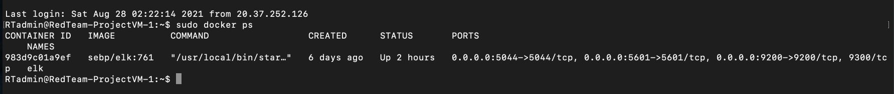
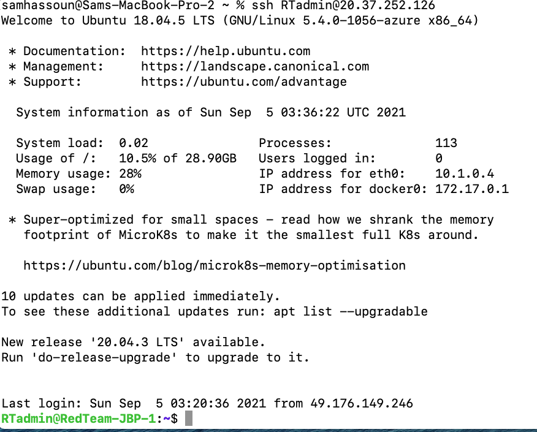
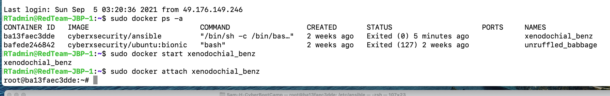
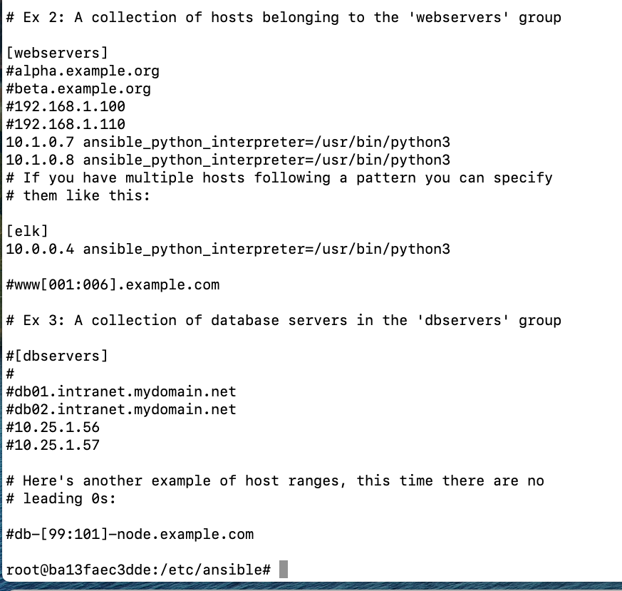
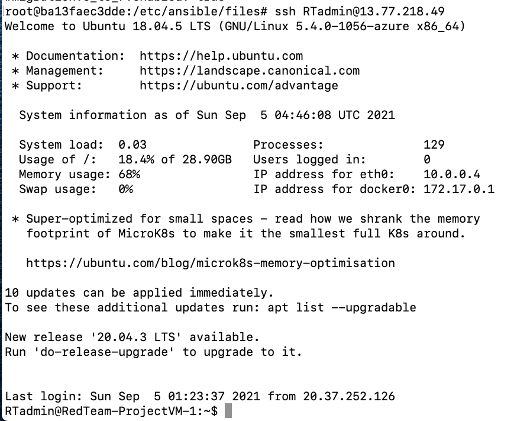
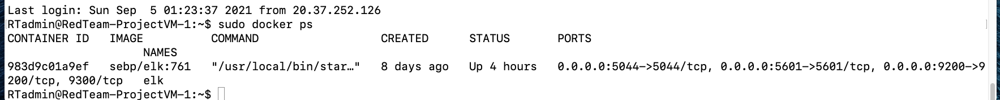
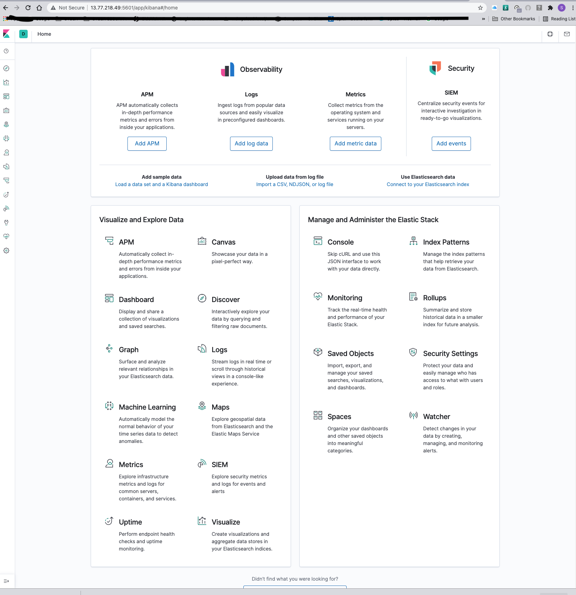

## Automated ELK Stack Deployment

The files in this repository were used to configure the network depicted below.

These files have been tested and used to generate a live ELK deployment on Azure. They can be used to either recreate the entire deployment pictured above. Alternatively, select portions of the playbook file may be used to install only certain pieces of it, such as Filebeat.

  - [How to Install and Launch filebeat](Playbooks/filebeat-playbook.yml)

This document contains the following details:
- Description of the Topology
- Access Policies
- ELK Configuration
  - Beats in Use
  - Machines Being Monitored
- How to Use the Ansible Build

### Description of the Topology

The main purpose of this network is to expose a load-balanced and monitored instance of DVWA, the D*mn Vulnerable Web Application.

Load balancing ensures that the application will be highly available, in addition to restricting traffic to the network.
 
Load Balancers are designed to protect the network from DDoS attacks by shifitng attack traffic from 1 server to others on the network to ensure a single server does not get overwhelmed to the point of becoming unavailable to authorised users and legitimate traffic.

The advantage of a JumpBox is it provides a secure method for admins to connect to servers in order to launch administrative tasks in a secure and monitored environment. This in essence, sets the JumpBox as a Secure Admin Workstation aslo referred to as SAW, whereby any Administrator will be required to connect to the JumpBox in order to perform any task in a secure environment.

Integrating an ELK server allows users to easily monitor the vulnerable VMs for changes to the data and system logs.

Filebeat monitors any changes to the log files or locations that you specify, collects log events, and forwards them either to Elasticsearch or Logstash for indexing.

Metricbeat focuses more on the statistics and metrics from the operating system and from services running on the server in relation to the specific data being monitored. These metrics and statistics are then shipped to the output specified such as ElasticSearch or LogStash.
 
The configuration details of each machine may be found below.

| Name                | Function        | Public IP Address | Private IP Address | Operating System   |
|---------------------|-----------------|-------------------|--------------------|--------------------|
| RedTeam-JBP-1       | JumpBox/GateWay | 20.37.252.126     |     10.1.0.4       | Linux Ubuntu 18.04 |
| RedTeam-ProjectVM-1 | ELK Server      | 13.77.218.49      |     10.0.0.4       | Linux Ubuntu 18.04 |
| RedTeam_LB          | Load Balancer   | 20.36.40.252      |         -          |          -         |
| RedTeam-Web-1       | WebServer       |        -          |     10.1.0.7       | Linux Ubuntu 18.04 |
| RedTeam-Web-2       | WebServer       |        -          |     10.1.0.8       | Linux Ubuntu 18.04 |

### Access Policies

The machines on the internal network are not exposed to the public Internet. 

Only the JumpBox Provisioner machine can accept connections from the Internet. Access to this machine is only allowed from the following IP addresses:

Machines within the network can only be accessed by SSH.

The only machines that I allowed SSH access to the ELK VM is the JumpBox Provisioner with IP address 10.1.0.4 and my Personal WorkStation.

A summary of the access policies in place can be found in the table below.

|         Name        | Publicly Accessible |      Allowed IP Addresses      | Protocol |    Port   |
|:-------------------:|:-------------------:|:------------------------------:|:--------:|:---------:|
|    RedTeam-JBP-1    |      Admin Only     |       Personal IP Address      |    SSH   |     22    |
| RedTeam-ProjectVM-1 |          No         | Personal IP Address & 10.1.0.4 | SSH/HTTP | 22 & 5601 |
|      RedTeam_LB     |         Yes         |         Any IP Address         |   HTTP   |     80    |
|    RedTeam-Web-1    |          No         |            10.1.0.4            |    SSH   |     22    |
|    RedTeam-Web-2    |          No         |            10.1.0.4            |    SSH   |     22    |

### Elk Configuration

Ansible was used to automate configuration of the ELK machine. No configuration was performed manually, which is advantageous because...
- The main advantage of utilising Ansible for automatic configuration is that it allows IT administrators to then shift their efforts to focus on other important daily tasks in administering a network no matter the size.

The playbook implements the following tasks:

[Install and Configure the ELK Server](Playbooks/install-elk.yml)

- Add the ELK Server to the [Ansible Host File](Playbooks/ansible-hosts-file)
- [Apt-Project-playbook.yml](Playbooks/apt-project-playbook.yml) 
- Use sysctl module to use more memory
- Install docker.io
- Install python3-pip
- Install docker container
- Launch docker container

The following screenshot displays the result of running `docker ps` after successfully configuring the ELK instance.

### Target Machines & Beats
This ELK server is configured to monitor the following machines: 
 
|      Name     |  Function | IP Address |
|:-------------:|:---------:|:----------:|
| RedTeam-Web-1 | WebServer |  10.1.0.7  |
| RedTeam-Web-2 | WebServer |  10.1.0.8  |

We have installed the following Beats on these machines:
- [FileBeat](Playbooks/filebeat-playbook.yml) 
- [MetricBeat](Playbooks/metricbeat-playbook.yml)

These Beats allow us to collect the following information from each machine:

- FileBeat has the capacity to monitor various log files or locations for changes via the Kibana dashboard.

[Kibana Main Screen](Images/Kibana-main-screen.png) 

[Syslog FileBeat Output](Images/syslog-events-filebeat.png) : In this Image we can see the FileBeat system generate output from syslog events that gives us an overview of events in the last 20 days ranging from login events and user information.

- MetricBeat collects metrics from the operating system and from specified services running on the Elk Server.

[MetricBeat Docker Container Output](Images/MetricBeat-docker-output.png) : In this image we see the output generated by the MetricBeat Docker COntainer output. This information provides an overview of the 2 containers running on the DVWA machines, CPU usage as well as memory usage over the last 20 days.

### Using the Playbook
In order to use the playbook, you will need to have an Ansible control node already configured. Assuming you have such a control node provisioned: 

SSH into the control node and follow the steps below:

- Copy the [FileBeat](Playbooks/filebeat-playbook.yml) and [MetricBeat](Playbooks/metricbeat-playbook.yml) file to /etc/ansible/roles.

- Update the [Ansible Host file](ansible-hosts-file) to include the WebServers and Elk Server WorkGroups.

- Run the playbook, and navigate to http://13.77.218.49:5601/app/kibana to check that the installation worked as expected.

 **Bonus**

Add ELK Server to [Ansible hosts file](Playbooks/ansible-hosts-file.png)

Launch [ELK-Install](Playbooks/install-elk.yml) playbook : ansible-playbook install-elk.yml

ssh from Ansible Container into the Elk Server : 

Verify the container is running:

Verify that the Elk Server can be loaded from Workstation browser:

